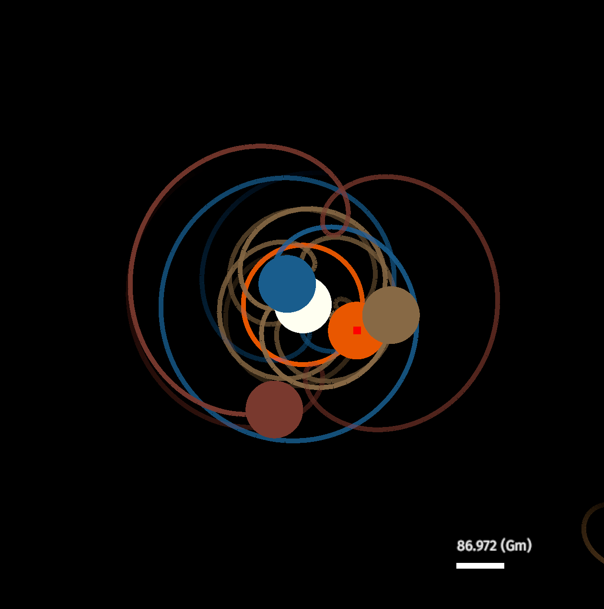

# nbodies

### A demonstration application for an general purpose point's physics engine
This project is an application that can simulate any stellar system configuration
and render it in 2D.



#### Features
- Simulate stellar systems with JSON data
- Build and simulate your own stellar systems using the GUI
- Visualize trajectories from any point of view

#### Usage
Clone the project and run `cargo build --release`. You can run the application using the
following command:
```
$ path/to/repo/target/release/nbodies [-o path/to/data.json] [-dt]
```
If you don't specify data the application will start empty.

A keymap is contained in the file `src/common.rs`, for know you can refer
to it to use the app. I'll be writing a tutorial soon.

Other optional options are provided:
- `-d` specify the distance scale of the simulation in px/m
- `-t` specify the distance scale of the simulation in s/real s