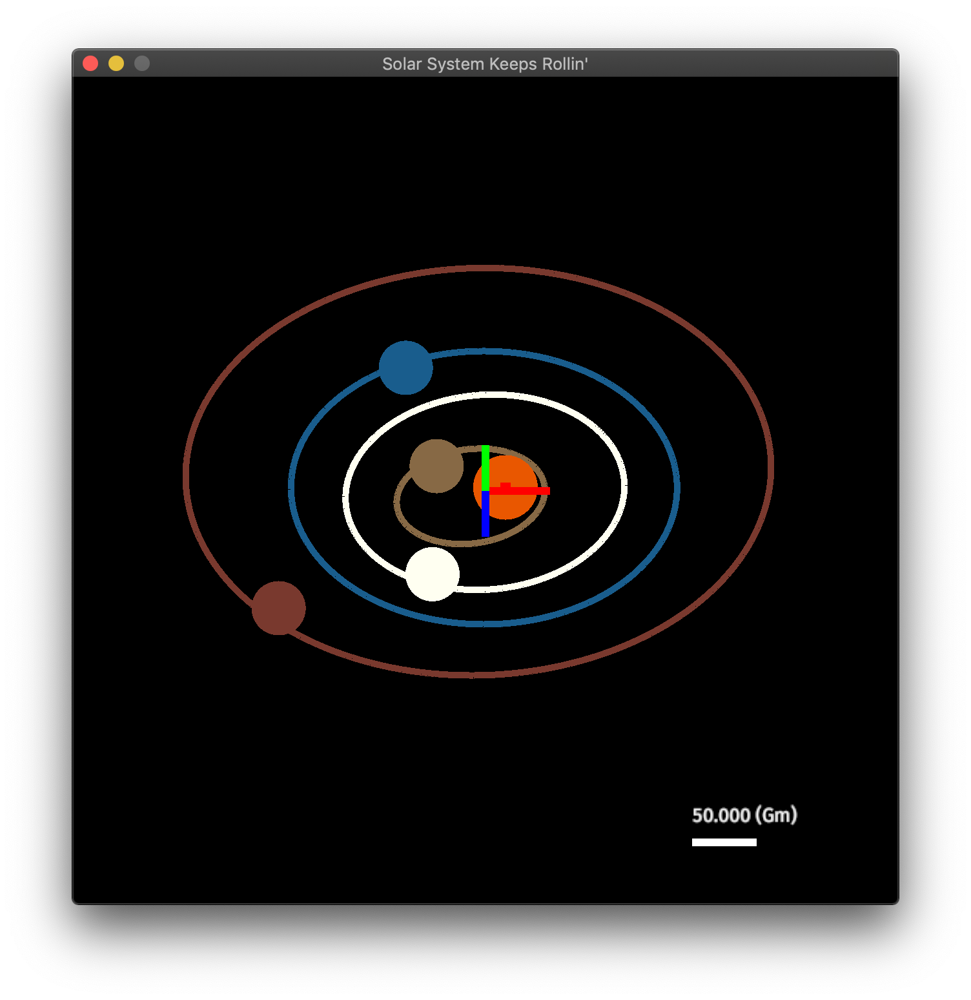

# nbodies

### A demo app for  [dynamics](https://github.com/samiBendou/dynamics) framework
This project is a game that can simulate any stellar system configuration and render it in 3D.



### Features
- Build and simulate your own stellar systems using the GUI
- Visualize trajectories and relative trajectories
- Simulate long periods (> 1Gy) with stability

## Usage
Before launching this code you have to clone a few libraries a made specially for this app :
- [dynamics](https://github.com/samiBendou/dynamics)
- [unitflow](https://github.com/samiBendou/unitflow)

Clone the repos above and modify your Cargo.toml to match the path of each with the path of each cloned repo.
That's the only way to compile for now since I did not put yet the above packages on crates.io

### Getting started
To get started with the application, you can launch a solar system simulation
```
$ cd path/to/repo
$ cargo build --release
$ ./target/release/nbodies -o data/solar_system.json -d 1e-9 -t 2e6 -s 4096
```
You may have to adjust   the time/distance scaling using U, I, Comma and Semicolon keys.
Use L key to show various log data in the console.

Press Space to play the simulation.

A keymap is contained in the file `src/common.rs`.

### Load JSON data
You can run the application using the following command:
```
$ path/to/repo/target/release/nbodies [-o path/to/data.json] [-d] [-t] [-w] [-h] [-s]
```
If you don't specify `-o` the application will start empty. You can specify JSON data representing the orbital
parameters of the system you want to simulation. See the file `data/solar_system.json` to have an example.

Other optional options are provided:
- `-d` specify the distance scale of the simulation in px/m
- `-t` specify the distance scale of the simulation in s/real s
- `-w` and `-h` specify the size of the app in px
- `-s` specify the simulation oversampling rate in number of iterations/step

### Build a system using UI
You can add and remove bodies in the system at convenience. 
Bodies gets deleted when they are to far away from the barycenter of the system.

To add a body, left click where you want to add it. A line from the body to the cursor appears,
it indicates your speed, left click again to set the speed of the body.
If you need more precise values use the logs provided in the console.

Right click on a body to delete it.
